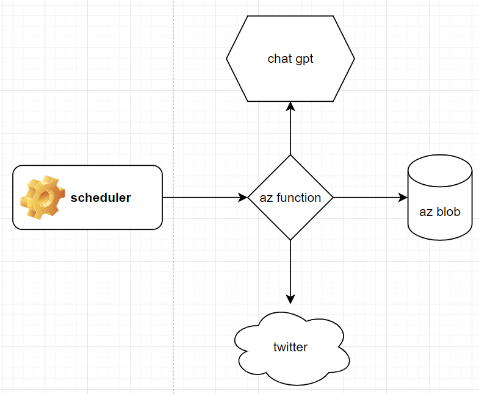
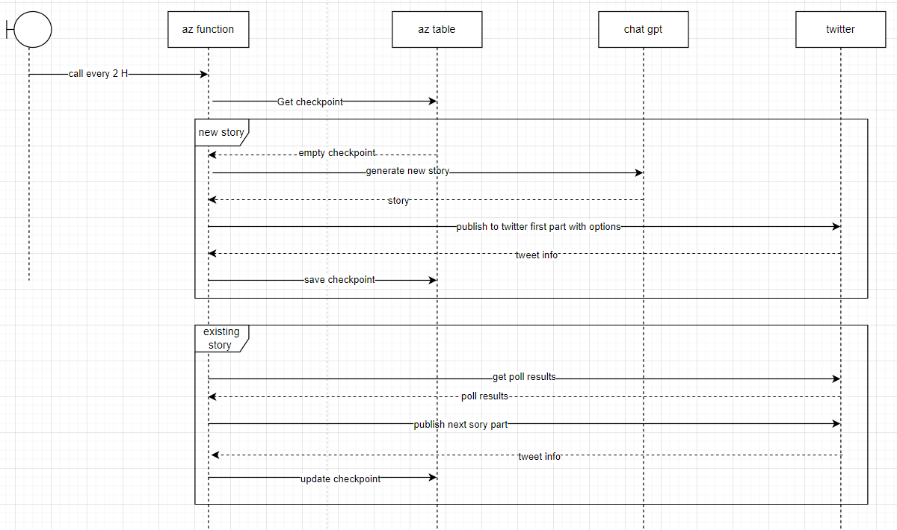

# Generated stories with twist choice
[](https://github.com/stPhoenix/twitter_stories/actions/workflows/python-app.yml)






### Features:
 - Generate story with twists with chat gpt
 - Publish it to twitter every 2 hours
 - Store full story as file on azure
 - Fully written deployment of infrastructure and az func app on azure with terraform

### Steps of deployment:
 - Create azure storage account to store terraform state file
 - Create container with name "tfstate"
 - Create keyvault with secrets for env variables of az func app
 - Add secrets. List of env vars could be found in example_env
 - Write next command in terminal: 
```shell
make deploy resource_group_name=RESOURCE_GROUP_NAME storage_account_name=TFSTATE_STORAGE_ACCOUNT_NAME
```